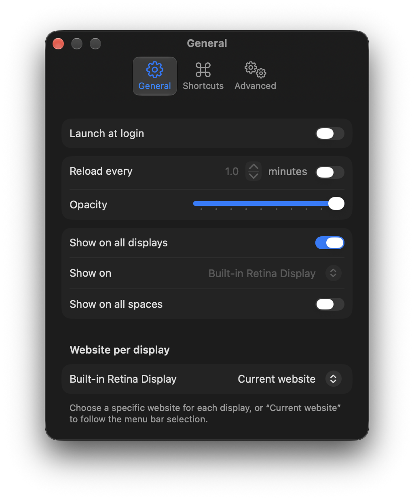
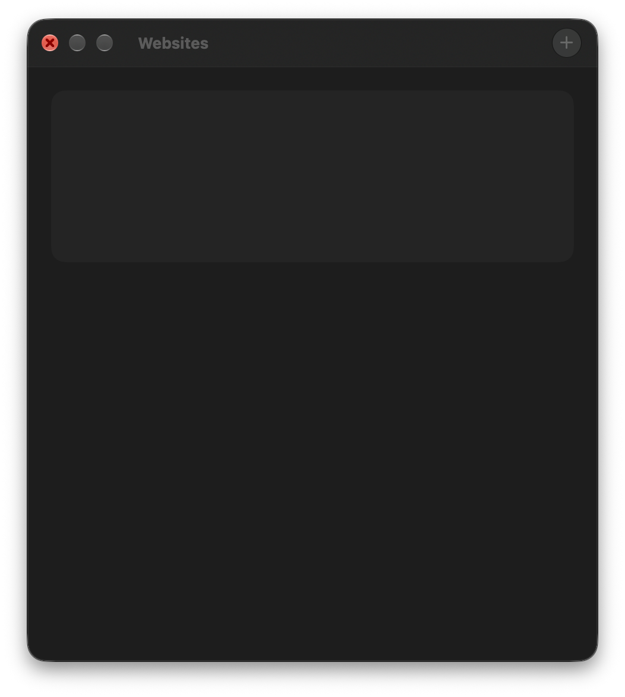

<div align="center">
	
	<h1>Webpaper</h1>
	<p><b>Put any website on your Mac desktop.</b></p>
</div>

Webpaper is a menu bar app. Pick a page — a calendar, a dashboard, a photo of the day, or a site you host yourself — and it stays behind your windows. You can keep a list of sites, switch between them, and show a different site on each display.

<p align="center">
	
	
</p>

## Download

Webpaper runs on **macOS 15.2 or later**. One download covers both **Apple silicon** and **Intel** Macs.

**[Download Webpaper for Mac](https://github.com/Errr0rr404/Webpaper/releases/latest/download/Webpaper-macOS.zip)**

Unzip it, move `Webpaper.app` to `/Applications`, and open it. The icon is in the menu bar, not the Dock. The first time you open a download, macOS may ask you to right-click the app and choose **Open**.

There is no Windows build. Webpaper is a Mac app: it draws on the desktop with AppKit, and that does not run on Windows.

## What it does

- Show a URL, or a local folder that contains `index.html`
- One display, or every display, with an optional site per display
- Browsing Mode, so you can click, scroll, and sign in
- Reload on a timer, or leave the page alone when the Mac wakes
- Fade in the first time a display loads
- Invert colors, custom CSS, and custom JavaScript (`await` is allowed at the top level)
- Print styles, self-signed certificates, opacity, and a transparent page background
- Remember scroll position across reloads of the same page
- Turn itself off on battery, and hide on the lock screen
- Launch at login, mute audio, and optional global shortcuts
- Share a link into Webpaper, or control it with the `webpaper:` URL scheme

## Use

Click the menu bar icon and choose **Add Website…**. Double-click a site in **Websites…** to edit it.

**Browsing Mode** lets you use the page. Right-click for back, forward, reload, zoom, or Inspect Element. Hold Option while clicking a link if it would otherwise open a new window. Webpaper adds the class `webpaper-is-browsing-mode` to `<html>` while this is on.

**Local Website…** expects a folder with `index.html`. Webpaper keeps a bookmark so it can read that folder again.

In any URL, `[[screenWidth]]` and `[[screenHeight]]` become that display’s size, excluding the menu bar. Example: `https://example.com/photo/[[screenWidth]]x[[screenHeight]]`.

A site can detect Webpaper: the class `is-webpaper-app` is on `<html>`.

To cover only half the desktop, put this in the site’s CSS field:

```css
:root {
	margin-left: 50% !important;
}
```

To scroll on each load, put this in the JavaScript field:

```js
window.scrollTo(0, 500);
```

## Scripting

Commands use `webpaper:command`, not `webpaper://command`.

```sh
open -g webpaper:reload
```

- `webpaper:add?url=<url>&title=<title>` — add a site. URL-encode the parameters. Add local sites from the app.
- `webpaper:reload` — reload the current site
- `webpaper:next` / `webpaper:previous` / `webpaper:random` — switch site
- `webpaper:toggle-browsing-mode` — toggle browsing mode

The same commands are available as Shortcuts actions: add, remove, enable, get or set the current site, reload, next, previous, random, and toggle browsing mode.

## Build

You need macOS 15.2 or later and the full Xcode app (not only the Command Line Tools).

```sh
git clone https://github.com/Errr0rr404/Webpaper.git
cd Webpaper
./build.sh run
```

`./build.sh` compiles a debug build. `./build.sh release` compiles a universal Release build (Apple silicon and Intel). `./build.sh clean` removes the build folder.

## License

[MIT](license).
