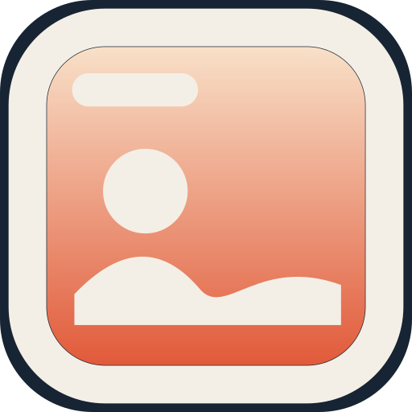

<div align="center">
	
	<h1>Webpaper</h1>
	<p><b>Put any website on your desktop.</b></p>
</div>

Webpaper keeps a live page behind your windows: a calendar, a dashboard, a photo of the day, or a site you host yourself. The Mac app lives in `mac`. The Windows app lives in `win`.

<p align="center">
	<video src="https://github.com/user-attachments/assets/77cbda82-52da-4069-a825-f5f8047b92c0" width="800" autoplay loop muted playsinline></video>
</p>

## Download

### Mac

**macOS 15.2 or later.** One download covers both Apple silicon and Intel.

**[Download Webpaper for Mac](https://github.com/Errr0rr404/Webpaper/releases/latest/download/Webpaper-macOS.zip)**

Unzip it, move `Webpaper.app` to `/Applications`, and open it. The icon is in the menu bar, not the Dock. The first time you open a download, macOS may ask you to right-click the app and choose **Open**.

### Windows

**Windows 10 or later, 64-bit** (Intel/AMD or ARM). There is no 32-bit build: the page is drawn with Chromium, which no longer ships a 32-bit browser.

On a Windows PC:

```sh
cd win
npm install
npm start
```

`npm run dist` builds a zip you can copy to another PC. `npm run dist:setup` builds an installer. Both need to be run on Windows if you want the setup program. The zip can also be built from a Mac.

The Windows app sits in the system tray. The page is pinned behind the desktop icons, so normal windows stay on top. **Browsing mode** lifts the page so you can click, scroll, and sign in.

## What it does

- Show a URL, or a local folder that contains `index.html`
- One display, or every display, with an optional site per display
- Browsing mode, so you can click, scroll, and sign in
- Reload on a timer, or leave the page alone when the computer wakes
- Invert colors, custom CSS, and custom JavaScript (`await` is allowed at the top level)
- Print styles, self-signed certificates, opacity, and a transparent page background
- Turn itself off on battery, and launch at login
- Mute audio, and optional global shortcuts

The Mac app also remembers scroll position, hides on the lock screen, accepts the Share menu, and answers Shortcuts actions.

## Use

**Mac:** click the menu bar icon and choose **Add Website…**. Double-click a site in **Websites…** to edit it.

**Windows:** click the tray icon and choose **Add Website…**, or use the Webpaper window.

**Browsing mode** lets you use the page. Webpaper adds the class `webpaper-is-browsing-mode` to `<html>` while this is on.

**Local folder** expects a folder with `index.html`.

In any URL, `[[screenWidth]]` and `[[screenHeight]]` become that display’s size. Example: `https://example.com/photo/[[screenWidth]]x[[screenHeight]]`.

A site can detect Webpaper: the class `is-webpaper-app` is on `<html>`.

To cover only half the desktop, put this in the site’s CSS field:

```css
:root {
	margin-left: 50% !important;
}
```

To scroll on each load, put this in the JavaScript field:

```js
window.scrollTo(0, 500);
```

## Scripting

Commands use `webpaper:command`.

Mac:

```sh
open -g webpaper:reload
```

Windows, after the app has been opened once so the link type is registered:

```sh
start webpaper:reload
```

- `webpaper:add?url=<url>&title=<title>` — add a site. URL-encode the parameters.
- `webpaper:reload` — reload the current site
- `webpaper:next` / `webpaper:previous` / `webpaper:random` — switch site
- `webpaper:toggle-browsing-mode` — toggle browsing mode

On the Mac, the same commands are available as Shortcuts actions.

## Build

### Mac

You need macOS 15.2 or later and the full Xcode app (not only the Command Line Tools).

```sh
git clone https://github.com/Errr0rr404/Webpaper.git
cd Webpaper/mac
./build.sh run
```

`./build.sh` compiles a debug build. `./build.sh release` compiles a universal Release build (Apple silicon and Intel). `./build.sh clean` removes the build folder.

### Windows

You need Node.js 20 or later.

```sh
cd win
npm install
npm test
npm start
```

## License

[MIT](license).
