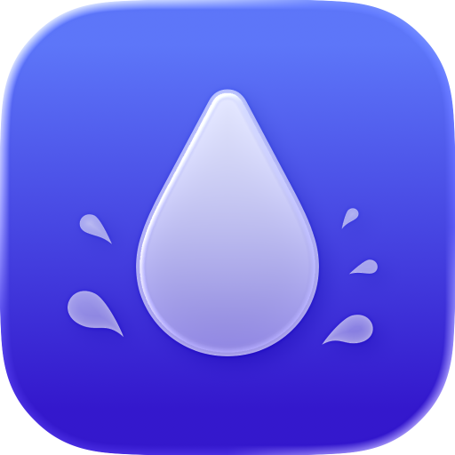

	
	<h1>Plash</h1>
	

		<b>Make any website your Mac desktop wallpaper</b>
	

	 
	 
	 

## Download

[Get it here](https://sindresorhus.com/plash)

## Where is the source code?

The app is no longer open-source. Despite initial hopes for community collaboration, the project received no contributions while facing challenges with App Store clones. The effort required to maintain it as open-source outweighed the benefits.

Rest assured, the app remains actively developed. I will continue using GitHub issues for requests and bug reports.

## Built with

- [Defaults](https://github.com/sindresorhus/Defaults) - Swifty and modern UserDefaults
- [KeyboardShortcuts](https://github.com/sindresorhus/KeyboardShortcuts) - Add user-customizable global keyboard shortcuts to your macOS app

## Links

- [More apps by me](https://sindresorhus.com/apps)
