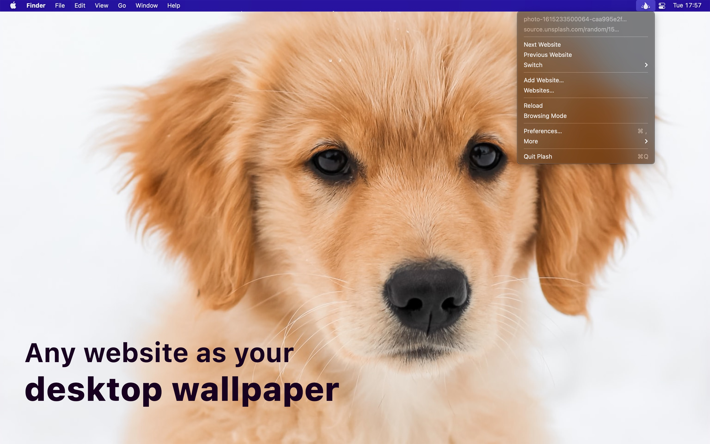
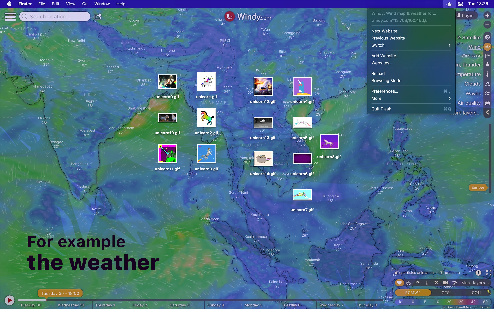
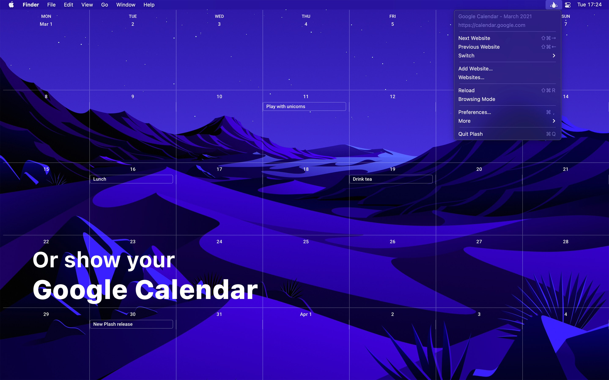
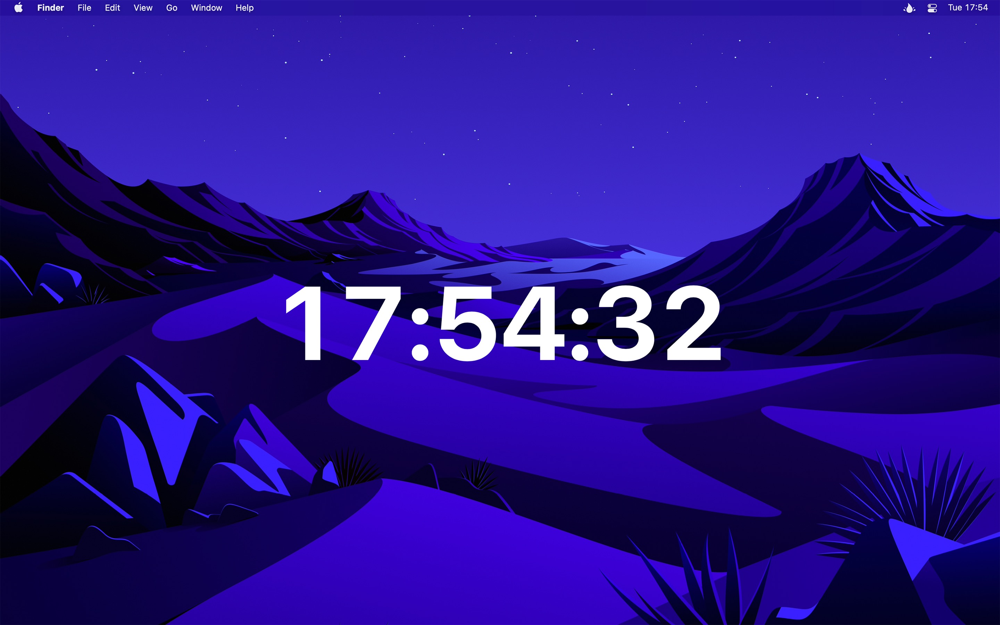
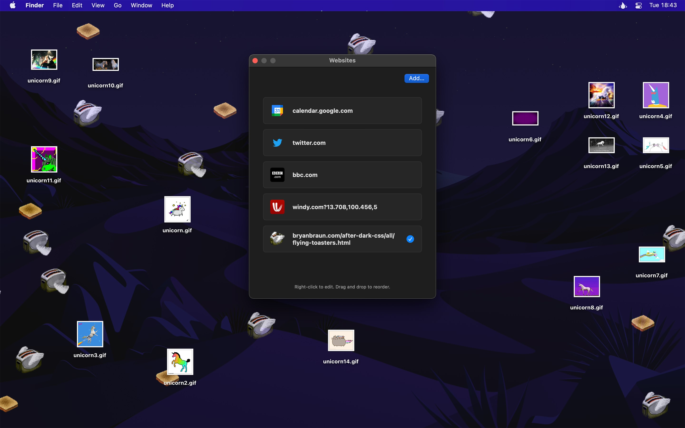

<div align="center">
	<a href="https://sindresorhus.com/plash">
		
	</a>
	<h1>Plash</h1>
	<p>
		<b>Make any website your Mac desktop wallpaper</b>
	</p>
	<br>
	<br>
	<br>
</div>

> [!NOTE]
> **Unofficial personal fork — source only.** This repository restores [Plash](https://sindresorhus.com/plash)'s last open-source release (v2.16.0, MIT-licensed) and adds the features in [What's new in this build](#whats-new-in-this-build), for personal use built from source. It is **not** affiliated with or endorsed by the author, and **no prebuilt app is distributed here**. Plash is created by [Sindre Sorhus](https://sindresorhus.com) — for the real, maintained app, get the [official version](https://sindresorhus.com/plash) or the [Mac App Store](https://apps.apple.com/app/id1494023538) and please support his work.

Plash enables you to have a highly dynamic desktop wallpaper. You could display your favorite news site, Facebook feed, or a random beautiful scenery photo. The use-cases are limitless. You could even set an animated GIF as wallpaper. You can even add multiple websites and easily switch between them.

## Use-cases

- [**Bing Photo of the Day**](https://github.com/sindresorhus/plash-bing-photo-of-the-day)
- **Calendar**\
	For example, Google Calendar or Outlook 365.
- **Personal stats**\
	You could even make a custom website for this.
- [**Random street view image**](https://randomstreetview.com/#slideshow)
- **Animated GIF**\
	Example: https://media3.giphy.com/media/xTiTnLmaxrlBHxsMMg/giphy.gif?cid=790b761121c10e72aca8bcfe50b030502b62a69ac7336782&rid=giphy.gif
- [**Random color**](https://www.color.pizza)
- **Build a custom website**\
	You could build something quick and host it on [GitHub Pages](https://pages.github.com), [jsfiddle](https://jsfiddle.net), or [CodePen](https://codepen.io).

[*Share your use-case*](https://github.com/sindresorhus/Plash/discussions/136)

## Features

- Show a remote or local website
- Interact with the website (“Browsing Mode”)
- Automatically reload the website at a custom interval
- Add multiple websites
- Show the website on one display, or on every display — with a different website per display
- Fade the website in on load
- Invert website colors (fake dark mode)
- Add custom CSS and JavaScript to the website
- Lower the opacity
- [Transparent background](https://github.com/sindresorhus/Plash/issues/1#issuecomment-573513816)
- Automatically deactivate while on battery
- Audio is muted
- Single image will be aspect-filled to your screen
- Hide menu bar icon
- Shortcuts support
- [Scriptable](#scripting)
- [Share extension](#share-extension)

## Download

Get the official Plash — actively maintained and notarized — from the Mac App Store:

[](https://apps.apple.com/app/id1494023538)

This fork does **not** ship a prebuilt binary. To try its extra features, [build it from source](#build-from-source) for your own use.

## What's new in this build

On top of the 2.16.0 source, this fork implements the most-requested community features:

- **Multi-display support** — show your website on **every** connected display, not just one ([#2](https://github.com/sindresorhus/Plash/issues/2)). Displays that are connected, disconnected, or reconnected (e.g. docking/undocking) are handled without disturbing the others.
- **A website per display** — in “Show on all displays” mode, assign each display its own website, complete with its own custom CSS/JS and settings.
- **Fade in on load** — the website fades in smoothly instead of appearing abruptly ([#9](https://github.com/sindresorhus/Plash/issues/9)).
- **“Reload when the computer wakes” toggle** — turn it off to keep page state across sleep ([#127](https://github.com/sindresorhus/Plash/issues/127)).
- **Retain scroll position across reloads** ([#39](https://github.com/sindresorhus/Plash/issues/39)).

Built and verified against **Xcode 27**. See [Build from source](#build-from-source) to compile it yourself.

## Tips

### Browsing mode

You can interact with the website by enabling “Browsing Mode”. When in this mode, you can right-click to be able to go back/forward, reload, and zoom in the page contents (the zoom level is saved). You can also pinch to magnify. This is different from zooming the page contents in that it will zoom in to a specific part of the page instead of just enlarging everything.

Plash injects a CSS class named `plash-is-browsing-mode` on the `<html>` element while browsing mode is active. You could use this class to customize the website for browsing mode.

If clicking a link opens it in a new window, you can hold the <kbd>Option</kbd> key while clicking the link to open it in the main Plash window.

### Zoom in website

To zoom in the website, activate “Browsing Mode”, right-click the website, and then select “Zoom In”.

### URL placeholders for screen width and height

Use `[[screenWidth]]` and `[[screenHeight]]` in any URL and Plash will substitute the right values for you. For example, `https://source.unsplash.com/random/[[screenWidth]]x[[screenHeight]]?puppy`.

### Scroll to position

You can scroll a website to a specific position each time it is loaded by putting the following in the website's “JavaScript” field. Adjust the “500” to how far down it should scroll.

```js
window.scrollTo(0, 500);
```

You can also [scroll to a specific element](https://developer.mozilla.org/en-US/docs/Web/API/Element/scrollIntoView) matching a [CSS selector](https://developer.mozilla.org/en-US/docs/Learn/CSS/Building_blocks/Selectors):

```js
document.querySelector('.title')?.scrollIntoView();
```

### Make the website occupy only half the screen

You can use the “CSS” field in the website settings to adjust the padding of the website:

```css
:root {
    margin-left: 50% !important;
}
```

### Detect Plash

Plash injects a CSS class named `is-plash-app` on the `<html>` element. You could use this class to customize your website for Plash. For example, if your website has instructions on how to use it in Plash, you could hide those when it's running in Plash.

## Screenshots







## Scripting

You can control Plash using anything that supports opening a URL with a custom scheme.

For example, to reload the current website, run this terminal command:

```console
$ open -g plash:reload
```

## Share extension

Plash comes bundled with a [share extension](https://support.apple.com/guide/mac-help/use-the-share-menu-on-mac-mh40614/mac). You can, for example, use it to quickly add a website you have open in Safari to Plash.

### Tools

- [plash-cli](https://github.com/sindresorhus/plash-cli) - Command-line tool.
- [alfred-plash](https://github.com/sindresorhus/alfred-plash) - Alfred workflow.
- [Raycast commands](https://github.com/raycast/script-commands/tree/master/commands#plash)

### Commands

#### `add`

Add a website to Plash.

You can optionally specify a title. If no title is given, a title will be automatically fetched from the website.

```console
$ open -g 'plash:add?url=https://sindresorhus.com/plash&title=Plash%20website'
```

*Don't forget to correctly encode query parameters.*

**Note:** Local file URLs are not supported.

#### `reload`

Reload the current website.

```console
$ open -g plash:reload
```

#### `next`

Switch to the next website in the list.

```console
$ open -g plash:next
```

#### `previous`

Switch to the previous website in the list.

```console
$ open -g plash:previous
```

#### `random`

Switch to a random website in the list.

It will never show the same website twice in a row, unless you only have a single website.

```console
$ open -g plash:random
```

#### `toggle-browsing-mode`

Toggle browsing mode.

```console
$ open -g plash:toggle-browsing-mode
```

### Examples

#### Node.js

```js
import {execFileSync} from 'node:child_process';

execFileSync('open', ['--background', 'plash:reload']);
```

#### Swift

```swift
import Cocoa

let command = "plash:reload"

let configuration = NSWorkspace.OpenConfiguration()
configuration.activates = false
NSWorkspace.shared.open(URL(string: command)!, configuration: configuration)
```

#### AppleScript

```applescript
do shell script "open --background 'plash:reload'"
```

#### Python

```python
import subprocess

subprocess.run(['open', '--background', 'plash:reload'])
```

## FAQ

#### The app does not show up in the menu bar

macOS hides menu bar apps when there is no space left in the menu bar. This is a common problem on MacBooks with a notch. Try quitting some menu bar apps to free up space. If this does not solve it, try quitting Bartender if you have it installed.

#### Can it automatically switch websites every 10 minutes?

Plash can be automated with the built-in Shortcuts app, for example, using the “Switch to Next Website” action. Shortcuts on macOS does not yet support automations, but for now, you can use the [Shortery app](https://apps.apple.com/app/id1594183810).

#### Does it support multiple displays?

Yes. Enable “Show on all displays” in the settings to render the website on every connected display. You can also assign each display its own website from the “Website per display” section.

#### Why does Plash use so much memory?

Plash uses very little memory. Usually around 40 MB. However, the websites you display can take up a lot of memory, and sometimes even have a memory leaks.

#### The menu bar does not adapt to the Plash wallpaper

The menu bar adapts its color from the actual system wallpaper. Plash is not actually a wallpaper, but rather runs right above the wallpaper. So Plash cannot influence the menu bar color.

#### Can Plash block ads?

Not built-in, but you can block ads system-wide with a [DNS ad-blocker](https://alternate-dns.com).

#### How can I switch to a specific website with a keyboard shortcut?

Make a shortcut in the Shortcuts app that uses the “Set Current Website” action and then set a keyboard shortcut for the shortcut.

#### Can I contribute localizations?

I don't plan to localize the app.

#### What does “Plash” mean?

[Click here.](http://letmegooglethat.com/?q=define+plash)

#### [More FAQs…](https://sindresorhus.com/apps/faq)

## Build from source

Requires a full **Xcode** install (16 or newer).

```sh
git clone https://github.com/Errr0rr404/Plash.git
cd Plash
./build.sh run        # build and launch
```

Other commands:

```sh
./build.sh            # build only (Debug)
./build.sh release    # build (Release)
./build.sh clean      # remove build artifacts
```

`build.sh` auto-detects your Xcode and shims SwiftLint when it isn't installed. To install into `/Applications`, produce a signed Release build and copy `Plash.app` over — the script header documents the exact steps.

## Built with

- [Defaults](https://github.com/sindresorhus/Defaults) - Swifty and modern UserDefaults
- [KeyboardShortcuts](https://github.com/sindresorhus/KeyboardShortcuts) - Add user-customizable global keyboard shortcuts to your macOS app
- [LaunchAtLogin](https://github.com/sindresorhus/LaunchAtLogin-Modern) - Launch-at-login for sandboxed apps

## License

Plash is created by [Sindre Sorhus](https://sindresorhus.com) and released under the [MIT license](license). This fork restores and builds on his last open-source release; all credit for the app itself goes to him.

## Links

- [Original app](https://sindresorhus.com/plash)
- [More apps by the original author](https://sindresorhus.com/apps)
